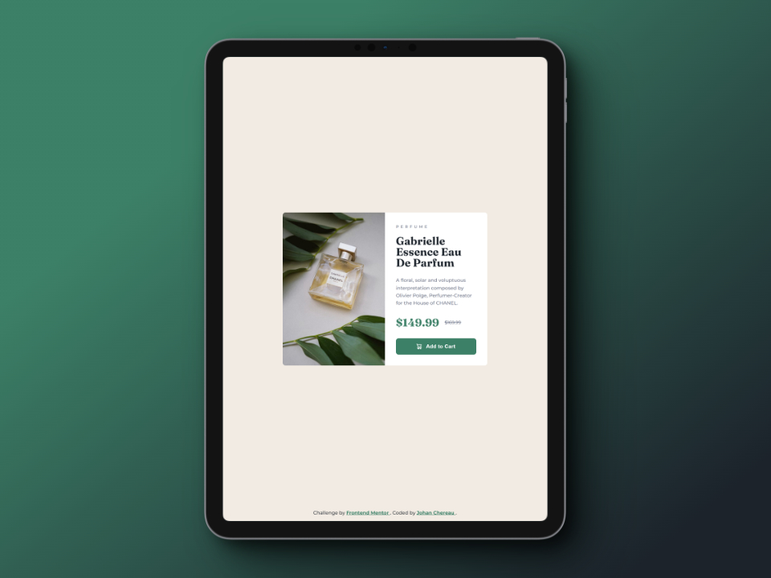
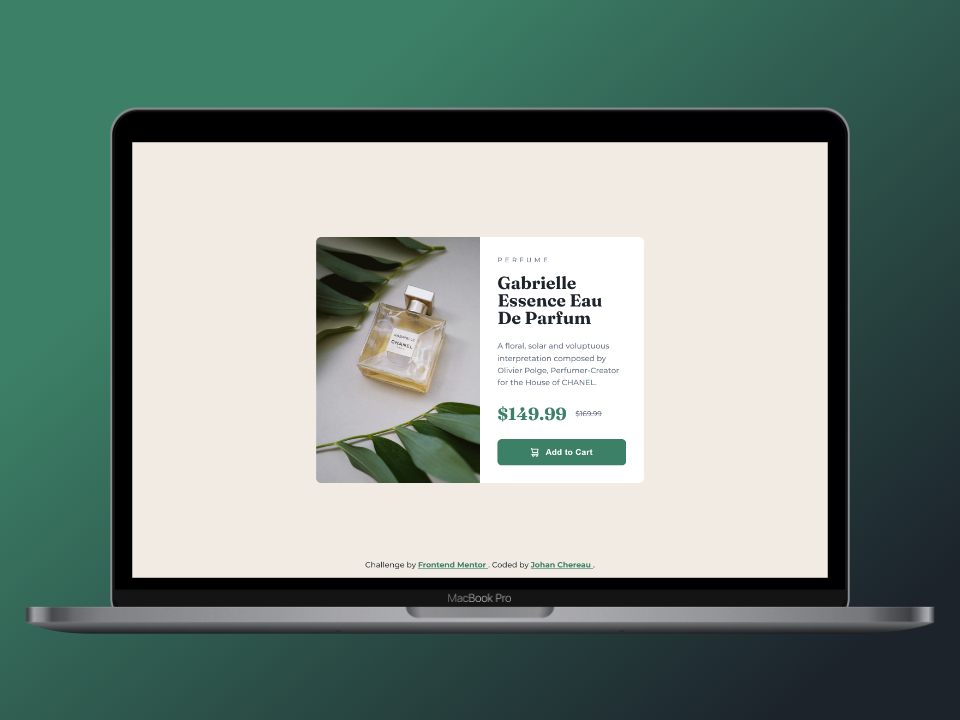

# Frontend Mentor - Product preview card component solution

This is a solution to the [Product preview card component challenge on Frontend Mentor](https://www.frontendmentor.io/challenges/product-preview-card-component-GO7UmttRfa). Frontend Mentor challenges help you improve your coding skills by building realistic projects.

## Table of contents

- [Overview](#overview)
  - [The challenge](#the-challenge)
  - [Design](#design)
  - [Screenshots](#screenshots)
  - [Links](#links)
- [My process](#my-process)
  - [Built with](#built-with)
  - [What I learned](#what-i-learned)
  - [Useful resources](#useful-resources)
- [Author](#author)
- [Acknowledgments](#acknowledgments)

## Overview

### The challenge

Users should be able to:

- View the optimal layout depending on their device's screen size
- See hover and focus states for interactive elements

### Design

#### Design to integrate


### Screenshots

#### Mobile view


#### Tablet view



#### Laptop view



### Links

- Solution on Front End Mentor: [Click here](https://www.frontendmentor.io/solutions/responsive-product-card-semantic-html-and-css-grid-flexbox-bem-kEbhFXEpVr)
- Live Site URL: [Click here](https://johanchereau.github.io/product-preview-card-component-main/)

## My process

### Built with

- Semantic HTML5 markup
- CSS custom properties
- Flexbox
- CSS Grid
- Mobile-first workflow
- BEM (Block, Element, Modifier)

### What I learned
- Use `<picture></picture>` and `<source/>` to change image source according to media queries.
```html
<picture class="product__image">
  <source
    srcset="images/image-product-desktop.jpg"
    media="(min-width: 600px)"
  />
  
</picture>
```

- An accessibility technique for visually hiding certain elements from the user, to be read only by the screen reader.
```css
.visually-hidden:not(:focus):not(:active) {
  clip: rect(0 0 0 0);
  clip-path: inset(50%);
  height: 1px;
  overflow: hidden;
  position: absolute;
  white-space: nowrap;
  width: 1px;
}
```

### Useful resources

- [CSS-Tricks - Inclusively hidden](https://css-tricks.com/inclusively-hidden/) - This resource helped me with the accessibility of my card, in particular for the current price and before discount.

- [MDN - Picture element](https://developer.mozilla.org/en-US/docs/Web/HTML/Element/picture) - To learn more about the picture tag.

## Author

- Frontend Mentor - [@JohanChereau](https://www.frontendmentor.io/profile/JohanChereau)

## Acknowledgments

- [Kevin Powell - Youtube](https://www.youtube.com/@KevinPowell)
